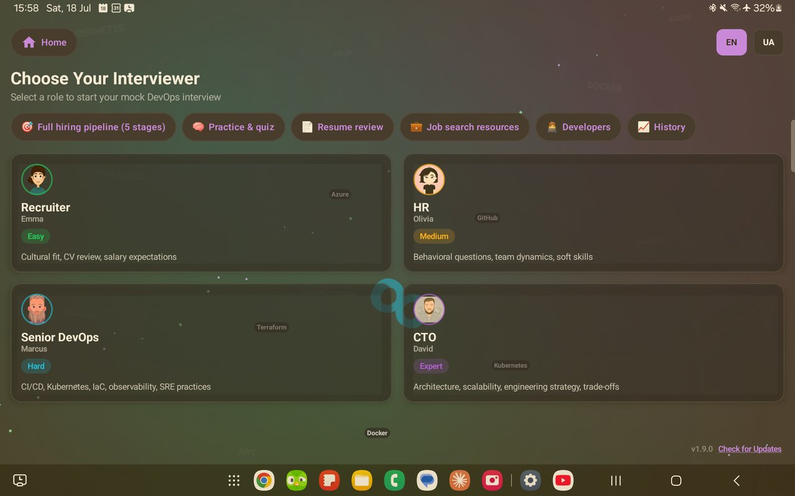
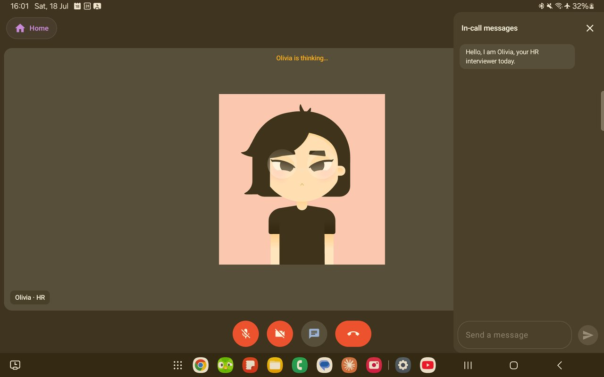

# devops-interview-app

Public release assets for **[DevOps Interview AI](https://github.com/AI-DevOps-Interview-Avatar/devops-interview-ai)** — an Android app that runs mock DevOps job interviews fully on-device using a local LLM (Gemma 3 1B via Google MediaPipe).

This repository intentionally holds **no source code** — only:

- the installable **APK**
- the **Gemma 3 1B model bundle** (`.task` file, ~530 MB)

both attached to **[Releases](https://github.com/AI-DevOps-Interview-Avatar/devops-interview-app/releases)**.

It exists as a separate, public repo so the app can download the model bundle **and check for app updates** from plain HTTPS URLs with no login or access token embedded in the client, while the application's source code stays in the private [devops-interview-ai](https://github.com/AI-DevOps-Interview-Avatar/devops-interview-ai) repository. Every new app version is published here automatically by CI, so the **[Releases](https://github.com/AI-DevOps-Interview-Avatar/devops-interview-app/releases)** tab of this repo is always the place to get the latest signed production APK.

---

## What the app does

**DevOps Interview AI** puts you in a realistic mock job interview — no account, no cloud, and no interview anxiety in front of a real human.

1. **Everything runs on your phone.** On first launch the app downloads the Gemma 3 1B language model once (~530 MB) behind a DevOps-pipeline-themed loading screen; after that, interviews work fully offline — your answers never leave the device.

2. **Pick your interviewer, or run the full pipeline.** Four personas with different difficulty levels and focus areas — from a friendly Recruiter (CV, culture fit) up to a CTO grilling you on architecture and trade-offs — plus a 5-stage hiring pipeline mode that gates each round until the previous one is complete. A **Home** pill and **EN/UA** language switcher sit at the top of every screen.

   

3. **The interview is a video call.** The session looks and feels like Google Meet: the AI interviewer sits in the large tile — a live-animated Rive avatar speaking out loud with lip-sync, gestures, and live captions — while your front camera shows in the corner. Answer by voice (tap the mic and just talk — a self-healing recognizer restart means it won't cut you off mid-thought) or type in the in-call chat panel.

   

4. **Practice, review, and prep beyond the interview itself.** Dedicated screens for browsing the question bank / self-quiz, an offline resume checklist, curated job-search resources, and a Developers page — all reachable from the nav pills on the selection screen.

5. **Get scored feedback.** After five questions the interviewer wraps up and evaluates your answers; past sessions are stored locally in the History screen.

### Staying up to date

The app checks this repository for new versions on startup, and you can always trigger it yourself: on the interviewer selection screen, tap **Check for Updates** next to the version number. Updates install over the existing build and never touch the downloaded model.

---

## Install on a physical Android device

1. Open the **[latest release](https://github.com/AI-DevOps-Interview-Avatar/devops-interview-app/releases/latest)** and download the `.apk`.
2. Tap the downloaded file on your phone.
3. If Android shows a security warning, tap **Settings** and enable **"Allow from this source"** for the app you used to open the file (browser, Files app, etc.), then tap **Install**.
4. Launch **DevOps Interview AI**. On first launch it downloads the Gemma 3 1B model (~530 MB) automatically and shows a progress screen — this only happens once. Wi-Fi is recommended.
5. Once the download finishes, pick an interviewer and start — the interview itself runs fully offline.

**Requirements:** Android 8.0+ (API 26), at least 4 GB of RAM, and an internet connection for the one-time model download.

---

## Install on an emulator (testers, no build required)

1. Create an AVD with at least **4096 MB RAM** and **4096 MB internal storage** (Android Studio → Device Manager → Create Virtual Device → pencil icon → Advanced Settings), and leave its network mode at the default (NAT) so the download screen can reach the internet.
2. Download the `.apk` from **[Releases](https://github.com/AI-DevOps-Interview-Avatar/devops-interview-app/releases)**.
3. **Drag and drop** the APK onto the running emulator window — Android installs it automatically.
4. Open the app from the emulator's app drawer and wait for the model download to finish.

> The default Android Emulator uses a software GPU, so MediaPipe falls back to CPU inference — responses are noticeably slower (~30–60s) than on a physical device. That's expected.

Full walkthroughs (Windows/BlueStacks/LDPlayer, building from source, troubleshooting) live in the main repo's [RUNNING.md](https://github.com/AI-DevOps-Interview-Avatar/devops-interview-ai/blob/main/RUNNING.md).

---

## License

The application (source in [devops-interview-ai](https://github.com/AI-DevOps-Interview-Avatar/devops-interview-ai)) and the binaries distributed here are licensed under the **Business Source License 1.1** by Alex Korchenko. Source is available for reference, learning, personal, educational, and non-commercial evaluation use; commercial use, redistribution, or derivative products require a separate commercial license. See the [LICENSE](https://github.com/AI-DevOps-Interview-Avatar/devops-interview-ai/blob/main/LICENSE) file in the main repo for the full text.

For commercial licensing inquiries, contact: **mainoceanm@gmail.com**
